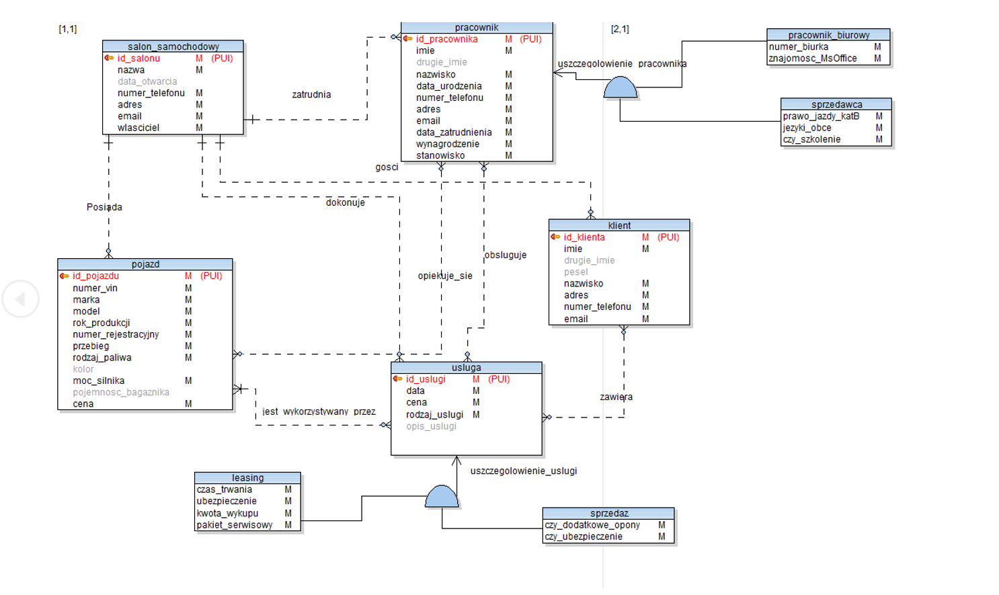
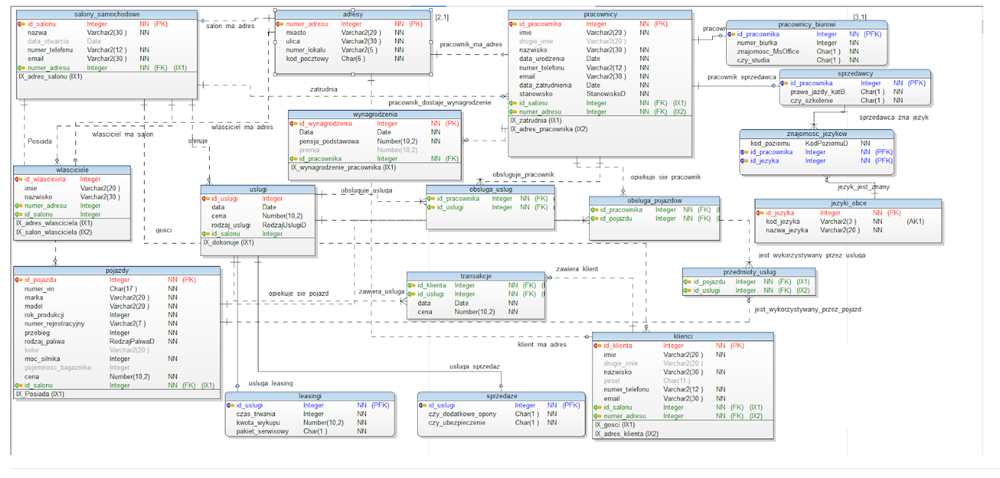
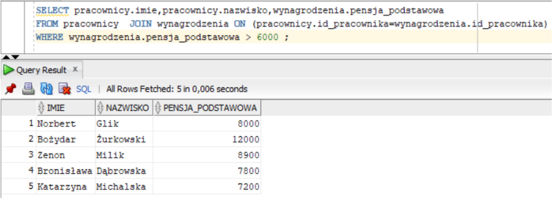

# SalonSamochodowy
# Projekt Bazy Danych i Big Data

## Cel projektu
Projekt składał się z dwóch głównych etapów:
1. Stworzenie bazy danych oraz wypełnienie jej abstrakcyjnymi danymi.
2. Stworzenie strony internetowej, która współpracuje z wcześniej stworzoną bazą danych.

Projekt był realizowany w ramach przedmiotu Bazy Danych i Big Data na studiach, w zespołach dwuosobowych.

## Narzędzia
- **Toad Data Modeler 7.2:** Projekt bazy danych.
- **Oracle Database 19c:** Lokalna baza danych.
- **SQL Developer:** GUI do pracy z bazami danych SQL.
- **Java Oracle JDK 17**
- **Java Spring**

## Projekt bazy danych
Baza danych została zaprojektowana przy użyciu programu Toad Data Modeler. Składa się z dwóch głównych modeli:
- **Model Konceptualny:** 
- **Model Logiczny:** 

## Przykładowe zapytania SQL 
- pracownicy którzy dostają pensję podstawową większą od 6000
  
  
- 
## Opis
Projekt składa się z dwóch perspektyw: administratora z rozszerzonymi uprawnieniami do zarządzania, takimi jak modyfikacja, dodawanie i usuwanie pojazdów, oraz użytkownika, który po rejestracji lub zalogowaniu może przeglądać oferty oraz umawiać się na wizytę w salonie lub rezerwować dostępne auto. Bez konieczności logowania możliwe jest jedynie przeglądanie ofert salonu, strony głównej oraz zakładki kontakt.

## Prezentacja Wyglądu Strony

